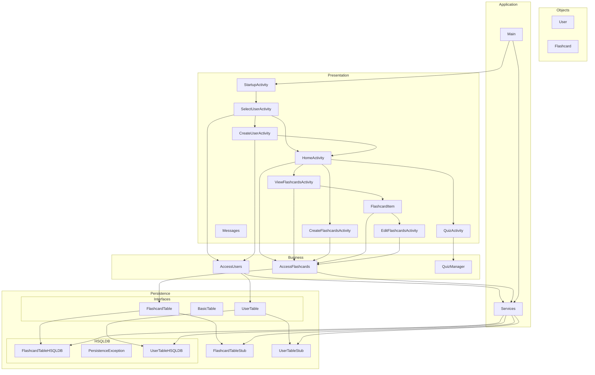

# Study Buddy Architecture

## Layers
We have 4 main packages in our project all located at /app/src/main/java/comp3350/studybuddy

### Presentation layer (*/presentation*)
- This is where the UI classes exist
- has android activity files like:
    - StartupActivity.java
    - HomeActivity.java
    - CreateFlashcardActivity.java
    - CreateUserActivity.java
    - SelectUserActivity.java
    - FlashcardItem.java
    - ViewFlashcardsActivity.java
    - QuizActivity.java
    - EditFlashcardActivity.java
    - CreateFlashcardActivity.java

### Business layer (*/business*)
- acts between the presentation and the data layer
- implements logic files like:
    - AccessUsers.java
    - AccessFlashcards.java
    - QuizManager.java

### Data layer (*/persistence*)
- Manages Data Storage. contains stubs for both users and flashcards that use a generic DatabaseTable class.
- also contains HSQLDB implementation
- Contains DB files like:
    - BasicTable.java
    - UserTable.java
    - UserTableStub.java
    - UserTableHSQLDB.java
    - FlashcardTable.java
    - FlashcardTableStub.java
    - FlashcardTableHSQLDB

### Objects (*/objects*)
- Contains objects lie:
    - Flashcard.java
    - User.java

## Tests
our tests are located at /app/src/test/java/comp3350/studybuddy, tests for each layer are in their
respective folder, with an AllTests.java file in the parent directory. This file will automatically
run all tests. We also now have integration tests that can be ran automatically by running IntegrationTests.java

## Mermaid Sketch
